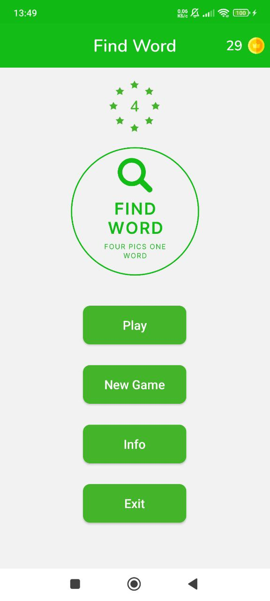
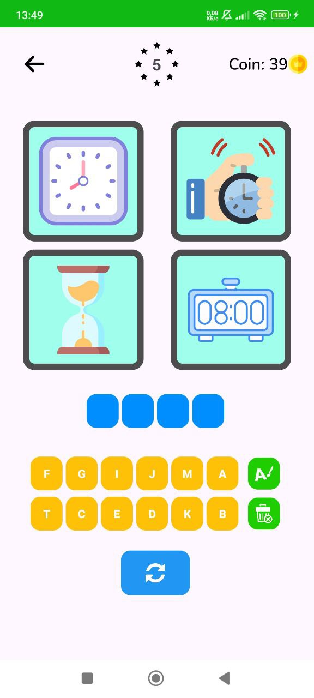
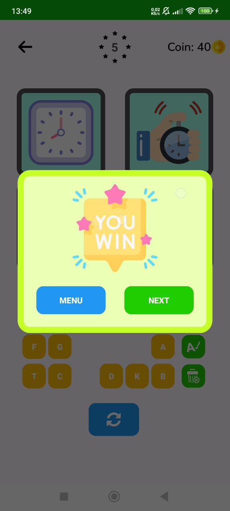
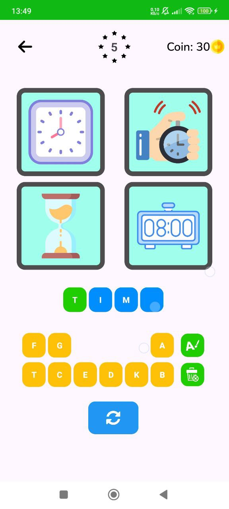

# Find Word - Android App

Welcome to the **Find Word** repository! This is a native **Android** application designed to help users find words through images. It is built using **Android Native** with **MVP** architecture, **Clean Architecture**, and follows best practices to ensure high maintainability and performance.

---

### 📱 **App Overview**

**Find Word** is a mobile app that allows users to guess and find words by looking at images. It provides an interactive way of learning and testing word association through images. The app is designed using **MVP** architecture to separate concerns, ensuring the application is easily maintainable and scalable.

The app makes use of **SharedPreferences** to store user data and preferences, and **Dialogs** for providing interactive feedback to users. It's built with a focus on a clean and intuitive user interface.

---

### 🚀 **Features**

- **Word Finding by Image**: Users are shown an image and must guess the word associated with it.
- **Interactive Dialogs**: Custom dialogs for displaying feedback and hinting at words.
- **User Preferences**: Store settings and preferences using **SharedPreferences**.
- **Single Activity Design**: The app uses a **Single Activity** approach to manage screens and navigation.
- **Clean Architecture (MVP)**: The app follows **Model-View-Presenter (MVP)** architecture, ensuring clear separation of concerns and better testability.

---

### ⚙️ **Technologies Used**

- **Android Native**: Developed using Android SDK.
- **Clean Architecture**: Separation of concerns with **Model-View-Presenter (MVP)** pattern.
- **SharedPreferences**: Used to store simple user preferences locally.
- **Dialog**: Custom dialogs for user interactions.
- **Kotlin**: Modern programming language for building Android apps.

<table>
  <tr>
    <td></td>
    <td></td>
  </tr>
  <tr>
    <td></td>
    <td></td>
  </tr>
</table>
